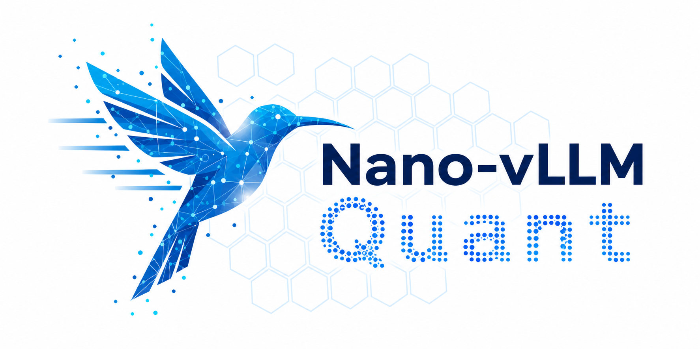

<p align="center">

</p>

# Nano-vLLM-Quant

This project is an improved implementation based on [Nano-vLLM](https://github.com/GeeeekExplorer/nano-vllm/tree/f438ce463f24700fb1d4671934abd2714d9e865f), adding quantized inference support with current focus on FP8 for the Qwen2, Qwen3, and Qwen3.5 dense model families.


## Key Features

* **FP8 Inference Support** - End-to-end FP8 inference with the following capabilities:
  * **FP8 Quantized Inference** - Supports FP8 weight loading, dynamic/static activation scaling, and block-wise FP8 GEMM for dense Qwen models.
  * **FP8 KV Cache** - Supports paged KV cache storage with `fp8`, `fp8_e4m3`, and `fp8_e5m2` dtypes.
  * **Tensor Parallel FP8 Execution** - Supports tensor-parallel FP8 linear layers, including fused QKV and gate/up projections.
  * **HF Quantization Config Compatibility** - Reads common Hugging Face FP8 quantization metadata, including ignored/excluded module lists.

  * Currently tested on `Qwen3-0.6B-FP8`, `Qwen3-4B-Thinking-2507-FP8`, and `RedHatAI/Qwen2-0.5B-Instruct-FP8`; other FP8 checkpoints using block-quantized dynamic activations or per-tensor static activations are expected to work

* **Qwen Model Family Support** - Supports text inference for dense Qwen model families:
  * **Qwen2** - Supports Qwen2-style dense decoder models with separate Q/K/V projections, GQA attention, RoPE, tensor-parallel linear layers, and FP8 checkpoints such as `RedHatAI/Qwen2-0.5B-Instruct-FP8`.
  * **Qwen3** - Supports Qwen3 dense decoder models with fused QKV and gate/up projections, RoPE compatibility, tensor parallelism, and FP8 checkpoints such as `Qwen3-0.6B-FP8` and `Qwen3-4B-Thinking-2507-FP8`.
  * **Qwen3.5** - Supports the `qwen3_5` text backbone, including hybrid `linear_attention/full_attention` layers. Vision/video inputs are not loaded by this runtime.
  
* **Inference Engine Features** - Runtime improvements for efficient and flexible text generation:
  * **Chunked Prefill** - Splits long prefills across scheduling rounds so oversized prompts can make progress under batched token budget limits.
  * **Extended Sampling Controls** - Supports `top_p`, `top_k`, and `min_p` in `SamplingParams`, including the fast path under default values.
  * **RoPE Compatibility** - Handles RoPE config differences across supported Qwen model families and transformers versions. See [ROPE.md](./ROPE.md) or upstream [PR #214](https://github.com/GeeeekExplorer/nano-vllm/pull/214) for details.


## Installation

```bash
pip install git+https://github.com/cuber726579/Nano-vLLM-Quant.git
```

## Model Download

To download the model weights manually, use the following command:
```bash
modelscope download  Qwen/Qwen3-0.6B-FP8
```

## Quick Start

```python
from nanovllm import LLM, SamplingParams
llm = LLM("/YOUR/MODEL/PATH", enforce_eager=True, tensor_parallel_size=1, kv_cache_dtype="fp8")
sampling_params = SamplingParams(
    temperature=0.6,
    top_p=0.95,
    top_k=50,
    min_p=0.0,
    max_tokens=256,
)
prompts = ["Hello, Nano-vLLM."]
outputs = llm.generate(prompts, sampling_params)
outputs[0]["text"]
```


## TODO

Remaining FP8 features not yet implemented include broader quantization formats and FP8 attention kernels.

See [TODO-FP8.md](./docs/TODO-FP8.md) for the full list including medium/low-priority items and known issues.
See [TROUBLESHOOTING.md](./docs/TROUBLESHOOTING.md) for runtime issues such as `Sampler.forward` hitting PyTorch Inductor codegen errors under `torch.compile`.

## Benchmark

See `bench.py` for benchmark.

**Test Configuration:**
- Hardware: RTX 4070 TISUPER (16GB)
- Total Requests: 256 sequences
- Input Length: Randomly sampled between 100–1024 tokens
- Output Length: Randomly sampled between 100–1024 tokens

**Basic Performance:**
- Model: Qwen3-0.6B

| Inference Engine | Output Tokens | Time (s) | Throughput (tokens/s) |
|----------------|-------------|----------|-----------------------|
| Nano-vLLM-Quant| 133,966     | 37.98    | 3526.98               |
| vLLM           | 133,966     | 38.39    | 3489.99               |

**FP8 Inference Performance:**
- Model: Qwen3-0.6B-FP8

| Inference Engine | Output Tokens | Time (s) | Throughput (tokens/s) |
|----------------|-------------|----------|-----------------------|
| Nano-vLLM-Quant| 133,966     | 41.69    | 3213.18               |
| vLLM           | 133,966     | 36.62    | 3657.78               |

**Chunked Prefill Update:**
- Model: Qwen3-0.6B-FP8

Nano-vLLM-FP8 now supports chunked prefill, allowing oversized prefills to be split across scheduling rounds instead of waiting for the whole prompt budget at once.

| Inference Engine | Output Tokens | Time (s) | Throughput (tokens/s) |
|----------------|-------------|----------|-----------------------|
| Nano-vLLM-Quant + Chunked Prefill | 133,966 | 31.01 | 4320.04 |

**Fast Path for New Sampling Controls**

| Inference Engine | Output Tokens | Time (s) | Throughput (tokens/s) |
|----------------|-------------|----------|-----------------------|
| Nano-vLLM-Quant w/o Fast Path | 133,966 | 47.93 | 2794.98 |
| Nano-vLLM-Quant w/ Fast Path  | 133,966 | 37.24 | 3597.75 |
